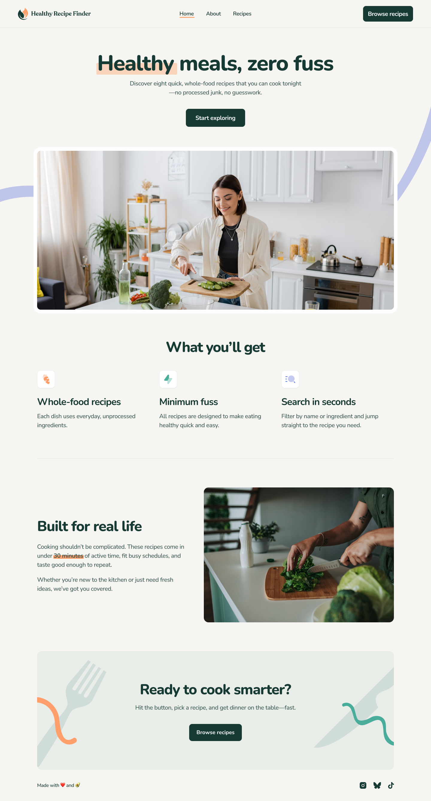

# React + Vite Project

## Recipe Finder multi-page website

The Recipe Finder is a responsive web application that helps users discover and explore a wide variety of recipes. Users can search, filter, and interact with dynamic recipe content, making it easy to find meals that suit their preferences.
Inspired by cutting-edge design and built with clean, reusable code, the website allows users to explore:

* View the home, about, recipes index, and recipe detail pages
* Search for recipes by name or ingredient
* Filter recipes by max prep or cook time
* View the optimal layout for the interface depending on their device's screen size
* See hover and focus states for all interactive elements on the page

## 📸 Screenshots

### Main Interface

### 🚀 How to install the project and run it
1. Clone the repository
2. Navigate to the project folder - cd your-repo-name
3. Install dependencies - npm install
4. Start the development server - npm run dev 

## 🔗 Links
- Solution URL (GitHub Repository): [Link](https://github.com/abdizahir/Recipe-finder-website/)
- Live Site URL (Deployed App): [Link](https://recipe-finder-website-six.vercel.app/) 

## 🛠️ Built With
- React – JS library
- Vite
- HTML5 & CSS3
- Tailwind
- JavaScript (ES6+)
- React Router

## Author
**Abdallah Mohammed**  
- GitHub: [github.com/your-username](https://github.com/abdizahir)   